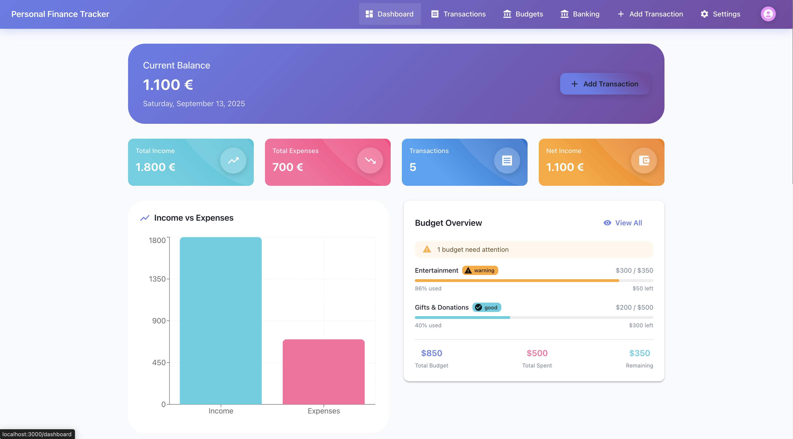
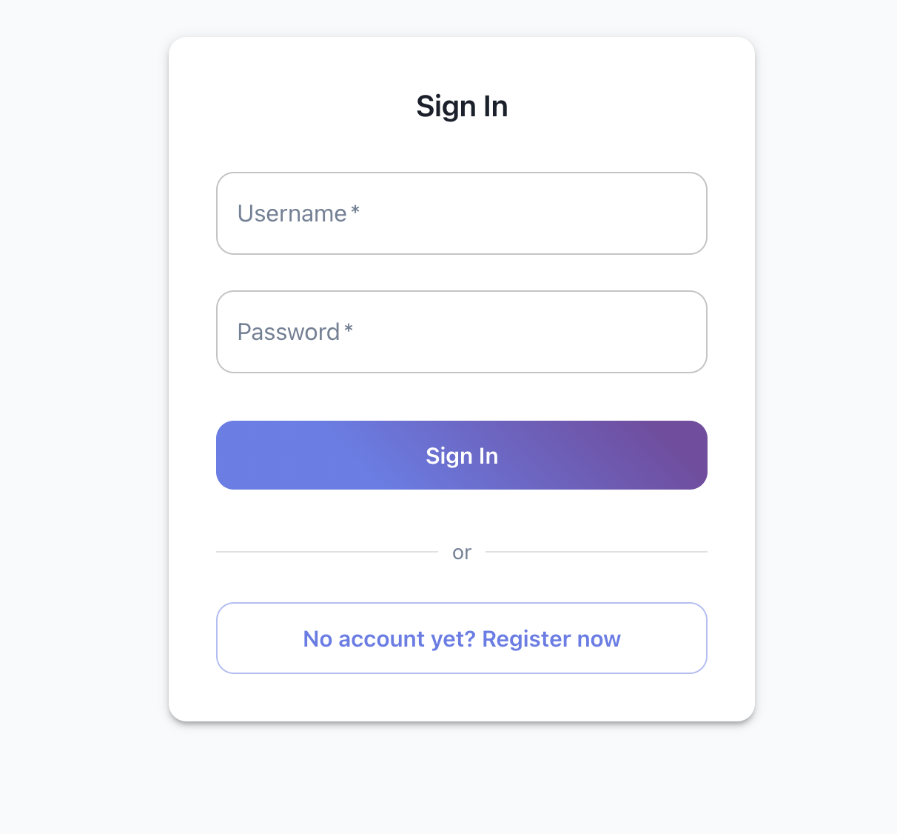
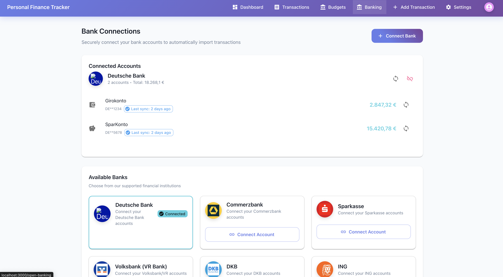

# Personal Finance Tracker – Frontend

A modern, responsive web application for managing personal finances. Built with **React** and **Material-UI**, it provides dashboards, analytics, and a smooth user experience.

---

## 🚀 Features

### 📊 Dashboard
- Real-time balance calculation
- Interactive charts (income vs. expenses, spending by category)
- Quick stats (total income, expenses, transaction count, net income)
- Recent transactions list
- Responsive, clean design

### 🔐 Authentication
- Secure login/registration with session-based authentication
- Optional Two-Factor Authentication (2FA)
- Protected routes & session management

### 💰 Transactions
- Full CRUD support (add, edit, delete)
- Categorization for better tracking
- Chronological transaction history

### 📱 User Experience
- Responsive design (desktop, tablet, mobile)
- Material-UI components
- Loading states & error handling

### 🏦 Open Banking (Demo)
- Simulated bank connections & imports
- Local storage per user account
- Clean, intuitive banking interface

---

## 🛠 Tech Stack

- **React** 18+
- **Material-UI (MUI)** v5
- **React Router** v6
- **Recharts** (charts & analytics)
- **Axios** (HTTP client)
- **React Context API** (state management)

---

## 📦 Getting Started

### Prerequisites
- Node.js (v14+)
- npm or yarn
- Running Django backend (see [backend repository](../backend))

### Setup
```bash
git clone <repository-url>
cd personal-finance-frontend
npm install
npm start

App runs on http://localhost:3000 by default.

## 📊 Screenshots

### Dashboard
Place your new UI screenshots under `docs/screenshots/` and reference here, for example:



### Login Screen


### Transaction List


### Banking


🏗 Project Structure
src/
├── components/
│   ├── auth/              # Login, Register, 2FA setup
│   ├── transactions/      # Transaction list & forms
│   ├── layout/            # Header, Sidebar, Layout
│   └── dashboard/         # Dashboard view
├── contexts/              # Auth & state management
├── services/              # API calls (auth, banking, transactions)
├── utils/                 # Formatters, helpers
└── App.js                 # Main entry


Built with ❤️ using React & Material-UI