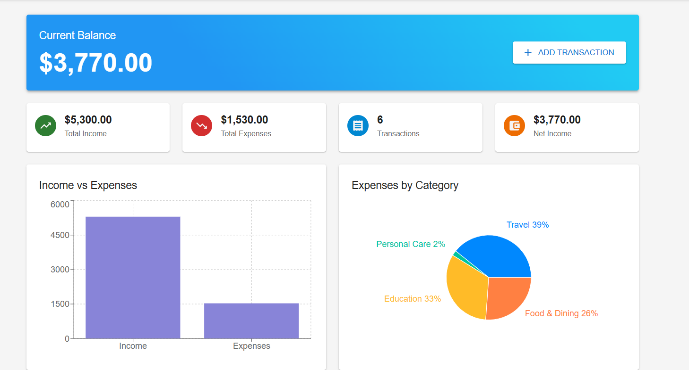
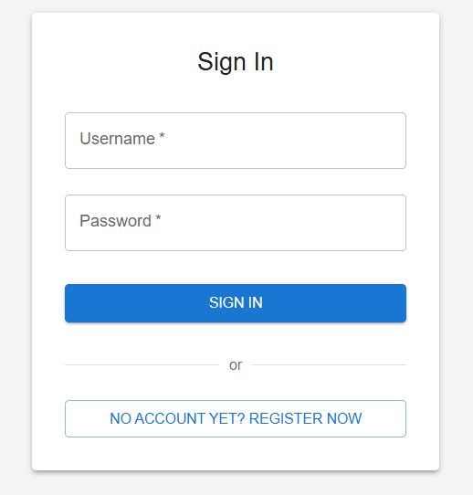
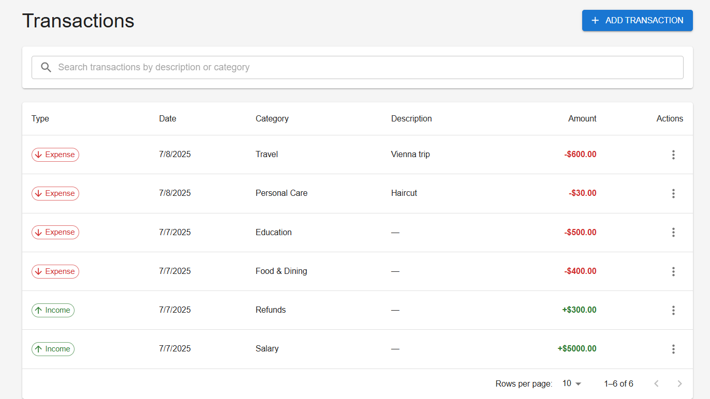
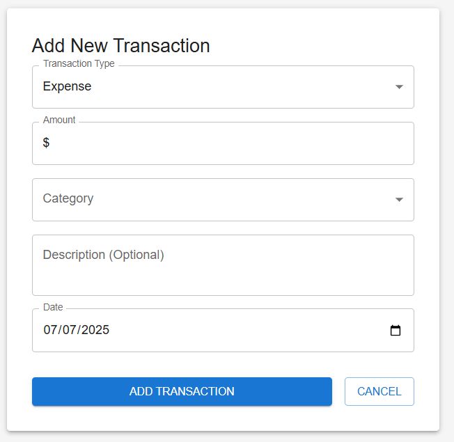

# Personal Finance Tracker - Frontend

A modern, responsive web application for managing personal finances built with React and Material-UI. Track your income and expenses with beautiful visualizations and comprehensive analytics.

## 🚀 Features

### 📊 Dashboard
- **Real-time Balance Calculation** - Automatically calculated from all transactions
- **Visual Analytics** - Interactive charts showing income vs expenses and spending by category
- **Quick Stats** - Total income, expenses, transaction count, and net income at a glance
- **Recent Transactions** - Latest 5 transactions with quick access to full transaction list
- **Beautiful Design** - Gradient backgrounds, color-coded elements, and responsive layout

### 🔐 Authentication
- **Secure Login/Registration** - Session-based authentication with CSRF protection
- **Two-Factor Authentication (2FA)** - Enhanced security with optional 2FA setup
- **Protected Routes** - Automatic redirection for unauthenticated users
- **Session Management** - Persistent login sessions with proper logout functionality

### 💰 Transaction Management
- **Add Transactions** - Easy-to-use forms for recording income and expenses
- **Edit/Delete** - Full CRUD operations on transactions
- **Categorization** - Organize transactions by categories for better tracking
- **Date Tracking** - Chronological organization of all financial activities

### 📱 User Experience
- **Responsive Design** - Works seamlessly on desktop, tablet, and mobile devices
- **Material-UI Components** - Modern, consistent UI following Material Design principles
- **Loading States** - Smooth user experience with proper loading indicators
- **Error Handling** - Comprehensive error messages and fallback states

## 🛠️ Technology Stack

- **Frontend Framework**: React 18+
- **UI Library**: Material-UI (MUI) v5
- **Routing**: React Router v6
- **Charts**: Recharts
- **HTTP Client**: Axios
- **State Management**: React Context API
- **Authentication**: Session-based with CSRF tokens

## 📦 Installation

### Prerequisites
- Node.js (v14 or higher)
- npm or yarn package manager
- Running Django backend (see backend repository)

### Setup Steps

1. **Clone the repository**
   ```bash
   git clone <repository-url>
   cd personal-finance-frontend
   ```

2. **Install dependencies**
   ```bash
   npm install
   # or
   yarn install
   ```

3. **Install additional chart library**
   ```bash
   npm install recharts
   ```

4. **Configure API endpoint**
   Update the API base URL in `src/services/api.js`:
   ```javascript
   const api = axios.create({
     baseURL: 'http://localhost:8000', // Update to your backend URL
     // ... other config
   });
   ```

5. **Start the development server**
   ```bash
   npm start
   # or
   yarn start
   ```

6. **Open your browser**
   Navigate to `http://localhost:3000`

## 🏗️ Project Structure

```
src/
├── components/
│   ├── auth/
│   │   ├── Login.js              # Login form component
│   │   ├── Register.js           # Registration form
│   │   └── TwoFactorSetup.js     # 2FA configuration
│   ├── transactions/
│   │   ├── TransactionList.js    # List view of transactions
│   │   ├── TransactionForm.js    # Add/edit transaction form
│   │   └── Dashboard.js          # Main dashboard with analytics
│   └── layout/
│       ├── Header.js             # Navigation header
│       ├── Sidebar.js            # Side navigation
│       └── Layout.js             # Main layout wrapper
├── contexts/
│   └── AuthContext.js            # Authentication state management
├── services/
│   ├── api.js                    # Axios configuration and interceptors
│   ├── auth.service.js           # Authentication API calls
│   └── transaction.service.js    # Transaction API calls
├── utils/
│   └── formatters.js             # Currency and date formatting utilities
└── App.js                        # Main application component
```

## 🔧 Key Components

### Dashboard
The main dashboard provides:
- Current balance prominently displayed
- Four key metric cards (Total Income, Total Expenses, Transaction Count, Net Income)
- Interactive bar chart comparing income vs expenses
- Pie chart showing expense breakdown by category
- Recent transactions list with quick actions

### Authentication System
- Secure login with username/password
- Optional two-factor authentication
- Session persistence with automatic logout
- CSRF token protection for all API calls

### Transaction Management
- Clean, intuitive forms for adding transactions
- Real-time validation and error handling
- Category-based organization
- Edit and delete functionality with confirmation dialogs

## 📊 Screenshots

### Dashboard


### Login Screen


### Transaction List


### Add Transaction Form


## 🔑 API Integration

The frontend communicates with a Django REST API backend:

### Authentication Endpoints
- `POST /api-auth/login/` - User login
- `POST /api-auth/logout/` - User logout
- `POST /api/auth/register/` - User registration
- `GET /2fa/status/` - Check 2FA status
- `POST /2fa/verify/` - Verify 2FA token

### Transaction Endpoints
- `GET /api/transactions/` - Fetch all transactions
- `POST /api/transactions/` - Create new transaction
- `PUT /api/transactions/{id}/` - Update transaction
- `DELETE /api/transactions/{id}/` - Delete transaction
- `GET /api/transactions/summary/` - Get transaction summary

## 🛡️ Security Features

- **CSRF Protection** - All requests include CSRF tokens
- **Session-based Authentication** - Secure session management
- **Input Validation** - Client-side and server-side validation
- **Protected Routes** - Authentication required for sensitive pages
- **Secure Headers** - Proper HTTP security headers implementation

## 🎨 Design System

### Layout
- **Responsive Grid**: Material-UI Grid system
- **Card-based Design**: Clean separation of content areas
- **Consistent Spacing**: Material-UI spacing system (8px base unit)

## 🔄 State Management

The application uses React Context API for:
- **Authentication State** - User login status and profile data
- **Transaction State** - Current transaction data and operations
- **UI State** - Loading states, errors, and notifications

## 📱 Responsive Design

The application is fully responsive and optimized for:
- **Desktop** (1200px+): Full featured layout with sidebar navigation

## 🧪 Testing

### Running Tests
```bash
npm test
# or
yarn test
```

### Test Coverage
- **Unit Tests** - Component logic and utility functions
- **Integration Tests** - API service interactions
- **E2E Tests** - Critical user flows (login, transaction creation)

## 🔧 Development

### Development Commands
```bash
npm start          # Start development server
npm test           # Run test suite
npm run build      # Build for production
npm run lint       # Run ESLint
npm run format     # Format code with Prettier
```

## 📝 Environment Variables

Create a `.env` file in the root directory:

```env
REACT_APP_API_URL=http://localhost:8000
REACT_APP_APP_NAME=Personal Finance Tracker
```

## 🤝 Contributing

1. Fork the repository
2. Create a feature branch (`git checkout -b feature/new-feature`)
3. Commit your changes (`git commit -m 'Add new feature'`)
4. Push to the branch (`git push origin feature/new-feature`)
5. Open a Pull Request

## 📄 License

This project is licensed under the MIT License - see the [LICENSE](LICENSE) file for details.

## 🆘 Support

If you encounter any issues or have questions:

1. Check the [Issues](link-to-issues) page for existing problems
2. Create a new issue with detailed information
3. Include screenshots and error messages when applicable

## 🔮 Roadmap

### Upcoming Features
- **Budget Management** - Set and track spending budgets by category
- **Recurring Transactions** - Automate regular income and expenses
- **Advanced Reports** - Monthly/yearly financial reports with export
- **Mobile App** - React Native mobile application
- **Bank Integration** - Connect to bank accounts for automatic transaction import

---

*Built with ❤️ using React and Material-UI*